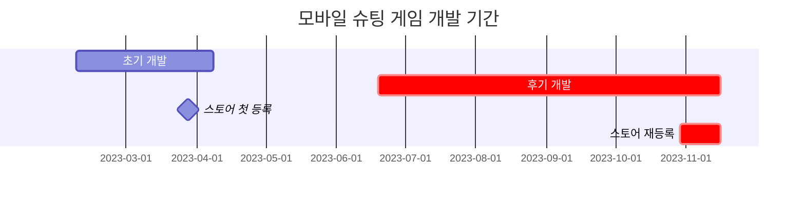
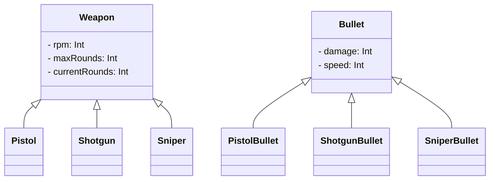

## **들어가며**

> [전 글](https://hynrng.github.io/posts/palette-planning/)로부터 이어집니다.
{: .prompt-info }



위에서 정리한 대로 개발기간이 초기와 후기로 나뉘기 때문에 포스트를 분리해 정리했습니다. 따라서 이 포스트에서는 후기 개발과 스토어등록 부분을 다루며, 주로 만들면서 어떤 생각을 했고, 어떻게 만들었는지에 대한 경험을 위주로 정리했습니다.

## **후기 개발: 무기 디자인**

### **동작 애니메이션** {#weapon-animation}

<!--유니티 에디터 -> 탄피배출 GIF-->
<!--탄피배출 효과는 파티클이펙트로 구현했습니다.-->

{: w="960" }
{: w="960" }
```cs
if (shotTimer > fireThreshold)
{
    WeaponAnimator.SetTrigger("Fire");
}

shotTimer += Time.deltaTime;
```
{: file="Weapon.cs" }

애니메이션을 구현하면서 유니티 애니메이션 컴포넌트를 처음 사용해봤습니다. 기능을 이것저것 건드려 보니 스프라이트 이미지를 교체하는 것 외에도 애니메이션 컴포넌트를 통해 오브젝트의 위치를 조정할 수 있어서 두 기능을 동시에 이용해 무기 반동 애니메이션을 만들었습니다.

처음 만들었을 때는 어색한 느낌이 많이 묻어나왔지만 총구 화염 크기를 크게 과장하고 URP Light2D를 활용하니 눈길을 끄는 화려한 효과를 얻을 수 있었습니다. 포스트 프로세싱의 Bloom까지 적당히 조절하니 만족스러운 느낌이 나와서 이 상태 그대로 사용중이에요.

{: w="480" }
{: w="480" }

총구 화염은 클립스튜디오의 애니메이션 기능을 활용해 구현했습니다. 이전에 공식 에셋을 활용한 경험이 있어서 이번에도 에셋을 찾아 사용할까 했지만, 제가 원하는 느낌의 에셋이 없어서 이번에는 직접 만들어서 사용했어요. 만들면서는 [다른 슈팅 애니메이션](https://www.youtube.com/watch?v=kAafHZcT2fc) 등을 참고하며 제가 원하는 느낌을 잡아갔습니다.

{: w="960" }
<!--코드-->

무기 오브젝트가 교체될 때의 부자연스러움을 덜기 위해 무기를 바꾸거나 새로 얻었을 때에만 재생되는 애니메이션도 만들어 적용했습니다. 오브젝트가 빌드되는 사이에 무기를 살짝 조작하면서 조작에 딜레이가 생기도록 만들었어요. 적용하고 나니 플레이 경험이 훨씬 부드럽게 이어지는 것처럼 보여서 만족스럽습니다.

### **적 피격 이펙트**

{: w="960" }
{: w="960" }
```cs
public void Hit()
{
    ParticleSystem hitEnemyParticle = hit.collider.GetComponent<ParticleSystem>();
    hitEnemyParticle.Emit(particleNumber);
}
```
{: file="Bullet.cs" }

피격 효과는 파티클 시스템을 이용해 만들었습니다. 처음에는 파티클이 무작위 방향으로 움직이면서 속도가 점점 줄어드는 정도로만 단순히 구현했는데 결과물이 생각보다 어색해서 고민을 했습니다.

이는 좀 우연찮게 해결했는데, 위처럼 Velocity over Lifetime 모듈에서 선형 속도와 공전 속도를 Random between two curves로 설정하고 그래프를 두번 꼬았더니 마치 먼지가 이는 듯한 효과가 만들어져서 이것을 사용했습니다. 보기에도 괜찮고 타격감도 꽤나 좋은 모습이에요.

### **장탄수 시스템**

{: w="960" }
{: w="960" }
```cs
public virtual void Update()
{
    if (roundsCurrent > 0)
        Fire();
    else if (!WeaponAnimationInfo.IsTag("Weapon_Reload"))
        WeaponAnimator.SetTrigger("RoundIsEmpty");
    else
        roundsCurrent = roundsMax;
}

public virtual void Fire()
{
    if      (currentRounds == 1) WeaponAnimator.SetTrigger("FiredLastRound");
    else if (currentRounds > 0)  WeaponAnimator.SetTrigger("Fired");

    roundsCurrent -= 1;
}
```
{: file="Weapon.cs" }

남은 총알을 표시하는 기능을 만들었습니다. 총알이 0이 되면 재장전 애니메이션이 재생되고, 재장전 애니메이션이 끝나면 장탄수는 무기 오브젝트에 설정된 최대 장탄수 값으로 회귀하도록 만들었어요. 플레이어 체력과 마찬가지로 장탄수 UI는 플레이어의 머리 위에 게임오브젝트의 형태로 표시되도록 간략히 만들었습니다.

약간의 디테일도 넣었는데, 재장전 애니메이션이 끝나지 않았는데 무기가 바뀔 경우 차후 그 무기를 다시 들었을 때 `Gained` 애니메이션과 구별되는 `GainedEmpty` 애니메이션이 재생되도록 만들었습니다. 차이점은 `GainedEmpty`의 경우 노리쇠 후퇴고정이 되어 약실이 보이는 상태로 재장전이 시작된다는 점이에요. 많은 FPS 게임에서 이 점을 구현하는 모습을 보고 따왔습니다.

### **데미지 이펙트**

{: w="960" }
{: w="960" }

데미지 이펙트 자체는 초기 개발 때 구현했지만, 동작이 애니메이션 컴포넌트가 아닌 코드로 구현되어 있기도 했고 그 비주얼도 많이 아쉬워서 다시 만들어주었습니다. 단순히 점점 투명해지면서 사라지던 것을 이펙트의 크기, 이동 속도까지 유동적으로 조절되도록 바꾸어 주었어요.

만들 때는 크리티컬 시스템도 같이 구현해 주었는데요, 확률적으로 데미지가 2배가 될 때 전용 애니메이션이 재생되도록 만들었습니다. 애니메이션은 크리티컬 데미지가 들어갔음을 쉽게 알 수 있도록 일반 데미지 애니메이션과 비교했을 때 크기와 색상에 차이를 두었어요.

### **무기 다양화**


```cs
public abstract class Weapon : MonoBehaviour
{
    protected int   RPM;
    protected int   maxRounds, currentRounds;

    public virtual void Awake()
    {
        /* ... */
    }
}
```
{: file="Weapon.cs" }
```cs
public class Pistol : Weapon
{
    public override void Awake()
    {
        base.Awake();
        
        maxRounds     = 10;
        rotationSpeed = 40;
    }
}
```
{: file="Pistol.cs" }

처음에는 총을 주로 만들 생각은 없었는데, 처음에 만든 것을 재사용하려다보니 무기를 총 위주로 여러개 만들게 된 것 같습니다. 만들면서는 객체지향 프로그래밍의 다형성을 의식하며 부모 역할을 하는 `Weapon.cs`{: .filepath } 클래스에 `RPM`, `maxRounds`, `currentRounds` 등 기본적인 것들을 작성하고 `Minigun.cs`{: .filepath }, `Shotgun.cs`{: .filepath }, `SMG.cs`{: .filepath } 등의 세부 무기 클래스가 이를 상속하여 동작하도록 만들었습니다.

상속을 활용해본 것은 이번이 처음인데 이전까지 코드를 작성하는 방식에 비해 작업이 확실히 효율적이었습니다. 반복되는 코드를 낮은 단계의 일원화를 이뤄서 말단 코드에 호출하여 사용한다는 것이 라이브러리를 사용하는 것과는 전혀 달라서 생소하기도 하고 신기하기도 했어요.

## **후기 개발: 애니메이션**

<!--
개인적으로 저는 게임이 재미있는 이유 중에는 "화면 속 캐릭터가 힘차게 움직이는 모습을 구경하는 재미"가 있다고 생각합니다.

찾아보니 스켈레톤 애니메이션이라던가, 절차적 애니메이션이라던가 등등 유니티가 제공하는 애니메이션 시스템 속에도 흥미로운 스킬이 많이 있는 것 같아 다음에 시도해보려고 합니다.
-->

### **플레이어 이동**

{: w="960" }
{: w="960" }

유니티에서 기본 제공하는 네모난 도형을 플레이어로 사용하는 것은 너무 성의가 없는 것 같아 새 몸통과 움직이는 다리를 달아주었습니다. 플레이어가 조이스틱을 최대 범위로 끌었는지의 여부에 따라 걷는 애니메이션과 달리는 애니메이션중 하나가 적절하게 재생되도록 했어요.

애니메이션 동작의 어색함을 덜기 위해 조이스틱을 당긴 정도에 따라 걷는 애니메이션 재생 속도가 유동적으로 조절되고, 또 조준 방향에 따라 플레이어가 뒤로 걸어가기도 하는 기능을 추가해주었습니다. 예를 들어 플레이어가 왼쪽으로 걷는데 적이 오른쪽에 있다고 한다면, 플레이어는 뒤로 천천히 걸어가며 적을 조준하는 식이죠. 결과적으로 움직임이 어색하지 않고 꽤 자연스럽게 보입니다.

### **경험치 시스템**

{: w="960" }
{: w="960" }

플레이 도중의 지루함을 조금이나마 덜어주기 위해 경험치 시스템을 만들었습니다. 적을 처치하면 플레이어는 경험치를 얻고, 경험치가 일정량 도달하면 레벨이 오르며 플레이어가 일정량 강화돼요. 누적된 레벨은 게임종료시 결과창에 점수의 형태로 나타납니다.

처음에는 플레이어가 경험치 파티클을 직접 얻어야 경험치를 획득할 수 있도록 만들었지만 플레이 후반부로 가면 갈수록 점점 많아지는 적에 의해 화면이 지저분해지는 문제가 있어서 적을 처치한 즉시 경험치를 획득하는 방식으로 변경했습니다. 적용하고 나니 지금의 방식이 정석적일 정도로 훨씬 깔끔한 것 같아요.

### **플레이 화면 진입**

{: w="960" }

개인적으로 이전 장면과 이후 장면이 딱딱하게 전환되는 것보다는 부드럽게 이어지는 것이 프로그램에게 배려받는듯한 감동이 있어 좋아합니다. 이 부분을 제 게임에도 적용해보고 싶었어요.

그래서 씬 전환시 플레이버튼을 누르면 단순히 씬이 전환되고 끝나는 것이 아닌, 동일 크기의 버튼 모양 오브젝트부터 플레이어가 등장하도록 만들었습니다. 버튼이 눌리면 메인 씬의 UI는 부드럽게 사라지고, 플레이 씬의 UI가 화면 가장자리에서 새로 등장하도록 처리했어요. 아마추어가 만든 듯 부족한 부분이 보이긴 하지만 다른 게임에는 없는 특이한 고유 경험을 만든 것 같아 조금 뿌듯한 부분이 있습니다.

## **후기 개발: 기타 작업**

### **이미지 에셋**

{: w="960" }
_갤럭시 탭으로 그림_

[앞서 설명했듯이](#weapon-animation), 이미지 애셋은 유니티 애셋스토어를 이용하지 않고 모두 스스로 만들어 사용했습니다. 무기를 먼저 픽셀아트로 그려냈더니 느낌이 어색하지 않아서 적, 피격 이펙트, 조이스틱, 경험치 바 등 다른 이미지도 픽셀아트로 만들었어요. 픽셀아트는 생각보다 그리는데에 부담이 없어서 시안을 여러 개 만들어보거나 사용중인 이미지를 새롭게 바꾸어보는 등 작업에 있어서 꽤 자유로웠습니다.

주로 클립스튜디오를 이용해 배경이 제거된 png 확장자로 내보낸 뒤 이미지 각각의 크기대로 잘라내어 임포트했고, 임포트한 이미지는 모두 Sprite (2D and UI)로서 Filter Mode는 Point (no filter)로, Max Size는 이미지 해상도에 맞게 설정해서 사용했습니다.

### **카메라**

저는 평소의 [사진 취미](https://hynrng.github.io/posts/photos-of-imin/)를 통해 화각으로 많은 것을 표현할 수 있음을 발견했고, 이를 제 게임에 적용해보고 싶었습니다. 유니티의 2D환경은 정사영(Orthographic) 방식으로 씬을 보여주므로 개념에는 차이가 있지만 얼마나 더 넓게 담을지에 대한 추상적인 관점에서는 2D에서도 고민할 부분이 있다고 생각했어요.

<div class="row">
    <div class="col-md-6">
        
    </div>
    <div class="col-md-6">
        
    </div>
</div>

그래서 게임을 만들 때 카메라 시야에 관여하는 `Camera.orthographicSize`값이 그때그때 제가 원하는 값으로 변경될 수 있도록 만들었습니다. 예를 들어 재장전을 하거나 새 게임이 시작될 때 무력감과 긴장감이 표현되면 재미있겠다는 생각에 화각이 좁아지도록 만들었죠. 테스트 어플리케이션을 빌드해서 직접 플레이해보니 의도가 잘 표현되면서도 게임플레이를 독특하게 만들어주는 것 같아 만족스럽습니다.

### **오디오**

{: .light .border }
{: .dark }
_크리티컬 효과음_

배경음, 효과음 등 소리 관련된 것들이 막상 하자니 조금 당혹스러웠던 부분이었습니다. 그림을 그리거나 코드를 짜는 것과는 달리 소리에 관련된 부분은 제가 아는게 하나도 없었거든요. 오디오 파일을 어디서 어떻게 구해야 하는지, 편집은 어떻게 하는지도 잘 몰랐습니다.

결과적으로는 이것저것 마구잡이로 찾아본 끝에 [Pixabay](https://pixabay.com/ko/sound-effects/)와 [GDC Game Audio](https://sonniss.com/gameaudiogdc)에서 무료 오디오 파일을 얻은 후 [Audacity](https://www.audacityteam.org/) 오디오 편집 프로그램을 이용해 노이즈 감소나 저음 증가 등 조금씩 편집해주면서 사용했습니다.

결과물이 나쁘지 않게 만들어지긴 했지만, 소리와 관련된 부분은 꽤 당혹스럽게 남아서 만약 다음에 게임을 만들게 된다면 효과음이나 배경음을 먼저 구하고 만들어야 할 것 같다는 생각이 들었습니다.

### **IAA (인앱 광고)**

{: w="960" }
```cs
void PlayerDied()
{
    ShowInterstitialAd();
}
```
{: file="GameSystem.cs"}

후기 개발중에서는 거의 처음에 구현했던 기능입니다. [간단한 주식 자동거래기](https://hynrng.github.io/posts/astp/)를 만들어보면서 API나 SDK 등 외부에서 배포하는 모듈을 사용하는 것에 관심이 있던 때라 호기심에 광고 호출 기능을 만들었어요. 플레이어가 죽어서 결과창으로 넘어가게 되면 도중에 전면 광고가 나오게 됩니다.

[구글 애드몹 공식 문서](https://developers.google.com/admob/unity/banner?hl=ko)를 참고하면서 만들었는데 공식 가이드를 천천히 따라가니 제 예상보다 너무 쉽게 만들 수 있었습니다. 결과물도 깔끔하게 작동해서 신기했어요.

### **IAP (인앱 결제)**

{: .light .border }
{: .dark w="960" }
```cs
void Purchase()
{
    if (playerDonateKimbab)
    {
        DonateKimbab();
        playerDonateKimbab = false;
    }
}
```
{: file="GameSystem.cs"}

인앱 결제 기능도 같은 맥락으로 구현해보고 싶었습니다. 다만 인앱 결제의 경우 게임 내에서 통용되는 화폐나 아이템 등이 없기 때문에 후원의 형태로 만들게 되었어요. 김밥, 불닭, 스테이크 등 3개 음식을 구상해 구글 콘솔에서 인앱 상품을 신청한 뒤 게임 내에서 보상 없이 결제가 이루어지도록 만들었습니다.

구현 도중에 인앱 결제를 구현할 때 조심해야 하는 것이 보안이라는 말을 들었습니다. 이 프로젝트는 토이 프로젝트의 성격이 짙기 때문에 수익을 노리고 만든 것이 아니라서 큰 상관은 없지만, 다음에 인앱 결제를 구현하게 된다면 조금 주의하면서 만들어야겠다는 생각이 들었습니다.

## **스토어 등록**

### **등록 준비**

{: .light .border w="240" }
{: .dark w="240" }
_어플 로고_

통일성을 위해 어플 로고는 플레이버튼과 동일한 이미지로 만들었습니다. 이 프로젝트에 있어서 스토어 등록은 약간의 상징적인 의미가 있는 것이지, 이 게임으로 관심을 끌고 싶다 이런 생각은 없어서 직관성이 떨어지는 것은 감수하기로 했어요. 어플의 패키지명은 개발자 계정과 개인적으로 부르던 프로젝트명으로부터 따와 `com.payang.palette`로 정했습니다.

### **스토어 등록**

{: .light .border w="960" }
{: .dark w="960" }
_구글 콘솔의 스토어 등록정보 작성란_

어플 등록은 플레이스토어로 한정했고, 따라서 구글 콘솔을 이용했습니다. 사실 [초기 개발 단계](https://hynrng.github.io/posts/palette-planning/)에서 한 번 등록한 적이 했는데, 어플 등록 과정 절차나 내 어플이 스토어에 정말 올라가는지가 궁금해서 호기심에 등록한 거라, 정상적으로 등록되는 것을 확인한 후 어플을 바로 비활성화시켰었습니다.

그리고 반년 넘게 시간이 지나자 더이상 이 프로젝트에 시간을 투입하는 것이 부담스럽게 느껴지기도 하고, 게임의 완성도도 처음보다는 꽤나 봐줄만해졌다 싶어서 어플을 업데이트한 후 활성화하기로 했어요. 등록중에 있어서는 어플명과 어플 설명을 새로 작성했고, 앱 아이콘과 그래픽 이미지, 그리고 자체 스크린샷 또한 새로운 것으로 업데이트했습니다.

{: .light .border w="960" }
{: .dark w="960" }
_구글 플레이 스토어에 게임이 올라간 화면_

최종적으로 어플이 다시 활성화되어 다운로드받을 수 있는 상태입니다. 어플 활성화 후 일주일 정도의 시간도 지나서, 제목을 검색하면 문제없이 노출이 되는 상태에요.

### **홍보와 피드백**

게임이 만들어졌으면 플레이해주는 사람이 있어야겠죠. 홍보도 마찬가지로 생각을 해본 적이 없었는데 그래도 만든 것이 '게임'이니 플레이해주는 사람이 있으면 좋겠다는 생각이 들었습니다.

그런데 이 게임은 처음부터 플레이하라고 만들었다기보다는 토이 프로젝트에 재미를 붙이다가 스케일이 불어난 경우에 가깝다 보니, 이걸 홍보하는게 맞는건가 하는 걱정이 들고, 또 개발 과정은 재미있었지만 홍보는 다른 문제로서 막상 제가 만든 것을 알리려니 부끄러움이 앞서더라구요.

{: .light .border w="960" }
{: .dark w="960" }

그래도 용기를 내서 해외 [Unity2D 서브레딧](https://www.reddit.com/r/Unity2D/comments/17p1toj/my_first_game_is_now_on_google_play_what_do_you/)에 짧은 글을 올렸습니다. 한 100명 봐주면 정말 감사하겠다 하는 마음으로 글을 올렸는데 일주일만에 조회수가 2만을 넘더니 한달 정도가 지나자 무려 10만에 가까운 분들이 관심을 가져주셨어요. 정말 놀랐습니다.

{: .light .border w="960" }
{: .dark w="960" }

그중에 몇몇 분은 정말 감사하게도 직접 플레이하시곤 이렇게 상세한 피드백까지 남겨주셨습니다. "조이스틱의 위치가 수정 불가능한 채로 고정되어 있어 불편하다", "블룸(Bloom)이 과한 것 같다", "타 게임과 비슷해 보인다" 정도의 피드백이 있었어요.

피드백은 공감하는 부분이 있지만, 당장은 더 이상 개발을 진행하고 싶지는 않아서 차후 시간이 날 때 조금씩 수정하거나 차기 프로젝트를 진행하게 되면 따로 반영하고자 합니다.

## **마치며**

> **[플레이스토어](https://play.google.com/store/apps/details?id=com.payang.palette&hl=ko-KR)**에서 다운받아 플레이해보실 수 있습니다.
{: .prompt-tip }

이것으로 오랜 시간 정성을 들인 프로젝트가 끝났습니다. 반 년 정도 신경을 쓰면서 시간을 보냈네요. 어플이 등록된 화면을 보면서 여러가지 생각이 들지만 개인적으로 가장 크게 느꼈던 것이 세 가지 정도 있습니다.

- 애니메이션을 만드는 것은 재미있고 뿌듯한 일이기는 하지만, 일일히 수작업으로 진행을 해야 하기 때문에 시간을 굉장히 많이 요구합니다. 전문 애니메이터가 아닌 이상 원하는 느낌의 애니메이션을 만드는 것은 마음의 준비를 해야 하는 일이고, 또 오브젝트별로 전용 애니메이션을 만드는 것은 비효율적입니다. 가능하면 여러개의 오브젝트가 같은 애니메이션을 공유할 수 있도록 만드는 것이 효율적이라는 생각이 들었어요.

- 즉흥적인 바텀업 방식으로 기획 없이  프로젝트를 만드는 것은 소규모 맥락에 있어서 재미는 있을지언정 그 한계가 분명히 있습니다. 개발을 하다가 흐름이 끊기고, 애니메이션을 만들다가 흐름이 끊기고, 만족스럽지 않으면 만들어놓은 작업물을 되돌리거나 삭제하고 새 작업물을 다시 만드는 일이 많았어요.  
때문에 처음에 기획을 치밀하게 준비했다면 이런 비효율적인 일은 예방할 수 있었을 것이라는 아쉬움이 계속 들었습니다. 그래서 다음에는 초기에 기획을 열심히 잡고 가려고 해요.

- 마지막으로 시간관리에 대한 부분입니다. 이 프로젝트는 원래 겨울방학에 길어야 한 달 정도 짧게 진행하고자 시작한 프로젝트였는데, 재미가 있다보니 여름방학 프로젝트가 되고, 또 그 다음 겨울방학 프로젝트가 될 뻔했어요.  
학기중에 개발을 병행하면서 게임을 만드는 일이 너무 재미있다보니 학업이 심리적 2순위로 밀리는 일이 일어나기도 했습니다. 자연스레 성적에 영향이 가면서 시간관리를 잘 못했다는 아쉬움이 남았네요.

<!--
{: .light .border }
{: .dark }
_만들면서 같이 활용했던 노션 페이지 일부_
-->

그래도 만드는 과정이 너무 재미있고 뿌듯한 경험으로 남아서 조만간 유니티로 아쉬움을 보완한 다음 마일스톤을 만들게 되지 않을까 싶습니다. 개발하면서 도중도중 알게 된 팁이나 패턴을 새로 적용해보고 싶기도 하고, 처음이 어렵지 두번이 어려울 것 같지 않기도 하고요. 그래도 만약 다음에 손을 들인다면 더 체계적인 계획과 준비과정으로 게임을 한 단계 더 발전시키고 싶습니다.