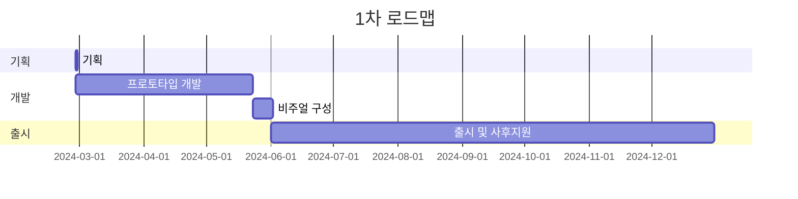

## **들어가며**

> [전 글](https://hynrng.github.io/posts/armonia-developing-first/)에서 이어집니다.
{: .prompt-info }

제 [네 번째 마일스톤](https://hynrng.github.io/categories/%EB%A7%88%EC%9D%BC%EC%8A%A4%ED%86%A4/) 개발기입니다. 또다른 한 달 동안 만든 결과물을 정리했습니다. 이번 한 달은 주로 게임의 시스템과 컨텐츠 확장 작업이 주가 되었으며, 세부적으로 이번 단계에서 만든 것은 다음과 같습니다.

게임 시스템
: - [x] 배경 오브젝트 계층화
- [x] 셰이더 그래프 교체를 통한 최적화
- [x] 핀치 줌아웃으로 접근 가능한 설정창
- [x] 절차적 애니메이션을 이용한 오브젝트 상호작용

추가된 오브젝트
: - [x] 뒷배경 역할을 하는 2종의 건물 오브젝트

## **아카이브**

{: .w-75 }
{: .w-75 }
_각각 설정창 진입을 테스트중일 때와 우연히 이색적인 분위기를 얻었을 때_

## **애셋**

### **이미지 에셋**

{: .light .w-25 .border }
{: .dark .w-25 }
_땅 쪼는 비둘기_

키프레임 형식의 애니메이션은 계속 추가해나갈 예정입니다. 이번의 경우, 비둘기에 대해 땅 쪼는 동작 구현을 위해 애니메이션을 만들어주었습니다. 애니메이션 분량도 짧고 무엇보다 [이전에 만들어둔 애셋](https://hynrng.github.io/posts/armonia-developing-first/#%EC%95%A0%EB%8B%88%EB%A9%94%EC%9D%B4%EC%85%98-%EC%97%90%EC%85%8B)이 있어서 전처럼 다른 비둘기 영상을 찾아보며 특징을 찾아 흉내낸다거나 하는 부담은 없었습니다.

전과 비슷하게 `DigState.cs`{: .filepath }를 만들어 상태 패턴과 연동하는 작업을 해주었고, 덕분에 동작도 자연스럽게 보입니다. 상호작용은 우선적으로 비둘기를 선택한 상황에서 땅을 터치하면 발동합니다.

### **셰이더 파일**

자세히 후술하겠지만, GPU 비용 문제가 있어 사용중인 2D 스프라이트 셰이더를 더 가벼운 것으로 변경했습니다. 문제는 이 셰이더는 그림자 생성(Cast shadow) 기능이 없고 포스트 프로세싱의 심도(DOF) 효과가 적용되지 않습니다. 개선할 수 있으면 좋겠지만 셰이더는 아직 익숙하지 않아서, 자세히 공부하거나 연출상의 기능을 포기하거나 해야 할 것 같습니다.

## **개발**

### **설정창 구상 및 구현**

{: .w-75 }
_핀치 줌으로 설정창에 진입함_

설정창은 UI가 없는 깔끔한 화면을 최대한 보존하고 조금 재밌는 연출이 될 수 있도록 별도의 UI 표시 없이 핀치 줌으로 접근하도록 만들었습니다. 핀치 줌은 단계적으로 작동하며, 일정 범위 이내에서는 평범한 카메라 줌인아웃으로 동작되지만 일정 범위를 넘어서면 진동 피드백과 함께 설정창으로 진입하게 됩니다. 한 번 접근한 설정창은 핀치 줌인으로 나갈 수 있습니다.

설정창 UI는 마치 카메라처럼 보이도록 만들었습니다. 제 [사진 취미](https://hynrng.github.io/posts/photos-of-gyemyo/)와 관련해 평소 _POV Street Photography_ 영상을 보면서 느꼈던 감각을 그대로 옮긴 것인데요, 손에 잡힌 기기의 스크린 속의 정렬된 세상을 보다보면 나와 피사체 사이의 막이 하나 있음에도 불구하고 장면이 현실감 있게 연결되는 듯한 느낌이 들어 그 경험을 모방해보고 싶었습니다.

배터리나 시간의 경우 `SystemInfo.batteryLevel`나 `DateTime.Now`를 가져와 진짜 배터리와 시간을 표시하도록 만들었고, 셔터스피드와 조리개값은 포스트 프로세싱의 모션 블러와 심도 효과를 단계적으로 조절할 수 있도록 만들려고 합니다.

텍스트가 기본 폰트로 표시되는 등 아직 완성해야할 부분이 남아있지만, 지금까지 만들어진 것만으로도 경험이 유기적이고 독특하다는 느낌이 대강 들어 만족스럽습니다. 다만 이게 남에게도 매력적으로 보일 수 있을까에 대한 부분이 걱정인데, 조금 더 검증해볼 필요가 있을 것 같네요.

<!--하단 스와이프창 만들거임.-->

### **절차적 애니메이션 적용**

{: .w-75 }
_근처에 비둘기 있으면 한 번씩 쳐다봄_

[이전 마일스톤](https://hynrng.github.io/posts/palette-developing/)을 만들면서 절차적 애니메이션을 이용해 환경과 상호작용하는 유기적인 애니메이션을 만드는 것을 보고 정말 멋지다고 생각한 적이 있어서 잘 기억해두고 있다가 이번에 시도해봤습니다. 기술적으로 정교한 조건을 두어 구현하는 것인 줄 알았는데 유니티 패키지로 제공되기 때문에 생각보다 쉬웠고, 다만 코드로 제어하는 것이 생각보다 복잡했네요.

비둘기와 달리 사람은 머리, 몸, 다리 등이 개별 오브젝트로 독립적으로 나뉘어져 있어 [Animation Rigging 패키지](https://docs.unity3d.com/Packages/com.unity.animation.rigging@1.1/manual/index.html)의 `Multiple Aim Constraint` 컴포넌트를 이용해 사람의 머리 오브젝트가 일정 거리 내에서 비둘기를 향해   쳐다보는 기능을 시도삼아 구현했습니다.

```cs
public void ChangeSourceObject(GameObject discoveredObject)
{
    WeightedTransformArray sourceObjects = Constraint.data.sourceObjects;
    WeightedTransformArray newSourceObjects = new WeightedTransformArray(sourceObjects.Count);
    
    newSourceObjects[0] = new WeightedTransform();
    WeightedTransform wt = newSourceObjects[0];

    /* ... */

    newSourceObjects[0] = wt;
    
    data.sourceObjects = newSourceObjects;

    Animator.enabled = false;
    rigBuilder.Build();
    Animator.enabled = true;
}
```
{: file="People.cs" }

해당 기능을 구현하려면 `Multi Aim Constraint` 컴포넌트의 `Source Object` 속성을 씬 내의 오브젝트로 교환해야 하는데, 이 과정이 난관이 많아 힘들었습니다. 혹시라도 절차적 애니메이션의 `sourceObject`를 코드로 변경하고 싶은 분이 계신다면 다음을 참고하시면 도움이 될 것 같습니다.

- `sourceObjects`의 속성은 읽기 전용(read-only)입니다. 다른 지역 변수에 데이터 정의 후 `data.sourceObjects`에 새 값을 지정해야 합니다.
- 지정이 완료된 후에는 해당 오브젝트의 애니메이터를 비활성화한 후 `rigBuilder`를 빌드하시고, 이후 애니메이션을 재활성화해야 정상적으로 적용됩니다.
- 어떤 오브젝트가 다른 오브젝트의 `sourceObject`로 등록되었다면, 해당 오브젝트가 삭제될 때 자신이 등록된 `sourceObject` 속성을 None으로 변경해주어야 합니다.

[공식 문서](https://docs.unity3d.com/Packages/com.unity.animation.rigging@1.0/api/UnityEngine.Animations.Rigging.html)를 찾아봐도 해결법을 찾기 힘든 동작이나 오류가 있어서 난감한 상황이 많이 있었지만 결과적으로 잘 만들어낸 것 같습니다. 구현하고 나니 확실히 게임 분위기를 유연하게 만들어주는 효과가 있는 것 같네요. 나중에 3D 토이프로젝트라도 만들게 되면 꼭 더 잘 활용해보고 싶습니다.

### **프로파일러를 이용한 최적화**

{: .w-75 }
_유니티 프로파일러로 측정된 데이터 예시_

제 게임은 이상하게도 빌드 후 40FPS 수준의 프레임 유지가 안 될 정도로 발열이 심했습니다. 제 코드가 완벽하지는 않더라도 `GetComponent()`, `Find()` 등 무거운 함수를 피하고 `for`, `foreach`, 코루틴 등의 반복 동작이 있는 코드는 무리하게 실행되지 않도록 신경써서 작성하는 등 기본적인 부분을 잘 지키고 있다고 생각했는데, 분명 가벼워야 할 2.5D 프로젝트임에도 프레임이 떨어지는 것이 이해가 가지 않았습니다.

디버깅중에 금세 뜨끈해지는 폰이 불쾌하게 느껴져 처음으로 프로파일러를 이용한 최적화에 도전했습니다. 과정은 생각보다 단순했는데, 유니티 프로파일러가 녹화한 데이터구간 중 프레임이 높게 측정되는 부분에 대해 어떤 작업이 가장 많이 실행되고 있는지를 찾고 해당 부분을 개선해주는 것이 전부였습니다.

제 경우 `Semaphore.WaitForSignal`이 50~70%가량의 지분을 차지하고 있었는데, 이 경우 주로 셰이더를 가벼운 것으로 변경해주는 작업을 권장한다는 글을 보고 [이전에 찾았던 셰이더 파일](https://hynrng.github.io/posts/armonia-developing-first/#%EC%8A%A4%ED%94%84%EB%9D%BC%EC%9D%B4%ED%8A%B8-%EC%85%B0%EC%9D%B4%EB%8D%94)을 보다 가벼운 것으로 교체해줬더니 프레임은 60FPS가 안정적으로 유지되고, 발열은 완벽하진 않지만 상당수 줄었습니다.

이런 경험은 처음이었는데, 앞으로도 최적화는 주기적으로 신경 써야 할 것 같습니다.

## **출시 기준**

### **완주를 위한 목표의 필요성**

다양한 오브젝트에 대해 각각의 애니메이션과 상호작용을 만드는 것이 기본적으로 재밌고 흥미로운 일이지만 시간과 노력이 생각보다 많이 든다는 느낌을 받았습니다. 점점 숙련되고 노하우가 늘면서 작업 효율이 늘 것으로 생각했고, 실제로 많이 늘기는 했지만, 코드를 입력하거나 키프레임 애니메이션을 만드는 일은 타자를 치거나 화면에 선을 긋는 등 최소한의 물리적 노동을 요구하고 있었죠.

프로젝트가 커지고 감당해야 하는 애셋이 많아지면서 점점 제가 지고 있는 부담이 많아지고 있음 체감되기 시작했습니다. 예전에 유니티가 발간한 게임 업계 보고서에서 "씹어넘길 수 있을 만큼만 물어라(Don't bite off more than you can chew)"라는 충고를 본 적이 있는데, 지금 제 상황이 그런 쪽으로 가고 있는 것은 아닌가 고민이 되었습니다.

그래서 목표지점으로서의 출시 기준이 필요하겠다고 생각했고, 당분간은 [구글 피처링](https://play.google.com/console/about/guides/featuring/)을 신청할 수 있을 정도를 목표로 두기로 했습니다. 구글 피처링은 고품질의 앱과 게임에 대한 기준을 명확히 제시하고 있는데, 그중에는 대표적으로 다음과 같은 것들이 있습니다.

- [높은 사용자 평점](https://support.google.com/googleplay/android-developer/answer/138230?hl=en)
- [구글플레이 정책](https://play.google/developer-content-policy/#!?modal_active=none) 준수 여부
- [높은 안드로이드 바이탈(Android Vitals)](https://support.google.com/googleplay/android-developer/answer/9844486?hl=en&visit_id=638527380779176477-2227653483&rd=1) 점수
- 안드로이드와 구글플레이 [핵심 앱 품질 가이드라인 준수](https://developer.android.com/quality?hl=ko) 여부

특히 [Android Developers](https://developer.android.com/quality?hl=ko)에서는 좋은 사용자 경험에 대해 사용성(백업 및 복원 등), 접근성, 현지화, 딥 링크(번역 등), 시각적 매력과 장인 정신(애니메이션, 오디오, 컨트롤 등)... 이외에도 많은 기준과 예시를 제시하고 있습니다. 조금 더 세부화할 필요가 있지만, 큰 기준으로서는 참고하기 좋을 것 같습니다.

### **자체적으로 제시하는 세부 기준**

어플
: - [ ]  앱 아이콘
- [ ] 3D 사운드
- [ ] 간단한 튜토리얼
- [ ] 내부 텍스트 현지화

오브젝트
: - [ ] 5가지 이상의 오브젝트
- [ ] 오브젝트별 2가지 이상의 개성
- [ ] 오브젝트별 3가지 이상의 상호작용

배경
: - [ ] 비, 눈 등의 날씨 시스템
- [ ] 구름이 포함된 동적 스카이박스
- [ ] 화면에 3개 이상의 배경 오브젝트 보장

## **마치며**



여담이지만, 원래의 로드맵에서는 글이 발행되는 시점으로 오늘 또는 내일 완성을 목표로 하고 있었는데 역량 부족인지 한참 모자랐네요. 로드맵도 새로 제시하고 무엇보다 조금 더 분기별 역할과 목표를 세부화해야할 것 같습니다.

6월에 사회복무요원 복무가 시작되기 때문에 당분간 개발을 접어두고 훈련소를 가야 합니다. 향후 상황을 아직 잘 모르기 때문에 가능할지는 모르겠지만, 그래도 스트어 등록이 가능한 수준을 목표로 개발을 차근차근 이어나가고 싶습니다.