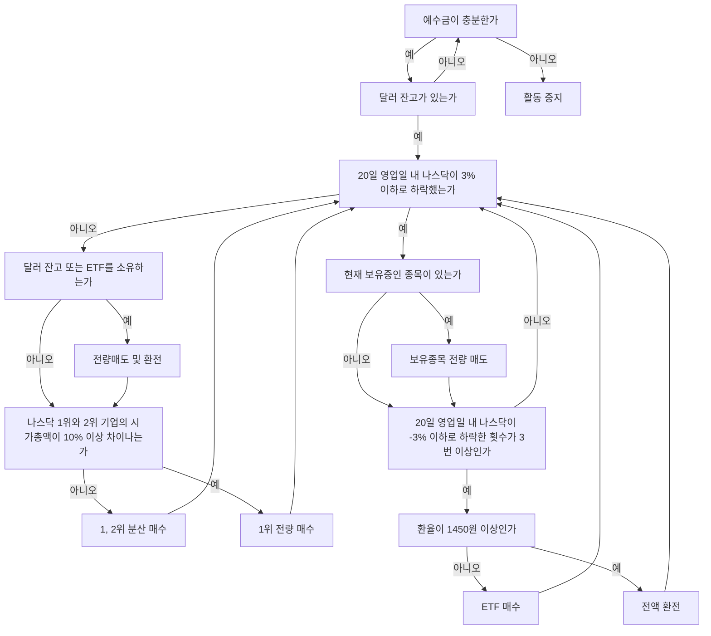

## **들어가며**

이번에 완성한 **ASTP(Auto Stock Trading Program)**는 내부 알고리즘에 따라 주식을 자동 매매하는 프로그램을 목표로 기획된 프로젝트로 **[제 두 번째 마일스톤](https://hynrng.github.io/categories/%EB%A7%88%EC%9D%BC%EC%8A%A4%ED%86%A4/)**입니다. 이런 프로그램을 만들어보고 싶다는 생각은 2021년 말에 했었는데, 1년이 지나서야 만들기 시작해 2023년을 바라보는 날이 되어서야 완성했네요. 프로그램은 파이썬을 이용해 만들었고, 주식과 관련된 부분에 대해 지인의 도움을 받아 기초적인 전략을 따르는 형태로 완성했습니다.

## **프로그램의 특징**

한국투자증권의 **[OpenAPI](https://www.truefriend.com/main/customer/systemdown/OpenAPI.jsp?cmd=TF04ea01200)**를 사용했습니다. 프로그램을 작성하면서 API는 처음 사용해봤는데 할 수 있는 것들이 생각보다 많아져서 놀랐네요. 매매전략은 두 가지를 따르는데, 해외주식(NASDAQ)을 기준으로 작동합니다.

알고리즘 요약
: - **주식 매수**: NDX 지수와 나스닥 상장 1, 2위 기업의 비율을 고려하여 주식을 매수합니다.
- **주식 매도**: NDX 지수가 폭락하거나 원달러 환율이 과도하게 상승할 경우 보유주식을 전량 매도하고 매매활동을 20영업일간 중지합니다. NDX 지수 폭락 여부는 주식장 시작과 종료 시점에 두 번씩 엑셀에 입력된 NDX 지수의 최대값과 최솟값을 비교하여 판단합니다.

사용 라이브러리
: - `mojito`: 한국투자증권의 OpenAPI 통합 파이썬 레퍼 모듈입니다.
- `yfinance`: NASDAQ 시가총액 순위를 조달하기 위해 사용합니다.
- `BeautifulSoup`: 주식 관련 모듈 모두에서 누락되어있는 NASDAQ-100 수치를 크롤링으로 조달받기 위해 사용합니다.

## **구조 및 예시 코드**



```python
# NDX 크롤링
def get_ndx():

    if response.status_code == 200:
    
        html = response.text
        soup = BeautifulSoup(html, 'html.parser')

        ndx_class = soup.find(class_ = 'Fw(b) Fz(36px) Mb(-4px) D(ib)')
        ndx = re.sub(r'[^0-9]', '', ndx_class.get_text())

    else :
        print(response.status_code)
    
    return ndx

# NDX -3% 여부 확인
def ndx_collapsed():

    df_ndf_data['ndx_index'] = df_ndf_data['ndx_index'].astype(float)
    ndx_decrse_3per = False

    ndx_max = df_ndf_data['ndx_index'].max()
    ndx_min = df_ndf_data['ndx_index'].min()

    if 100 * (ndx_max - ndx_min) / ndx_max > 3:
        ndx_decrse_3per = True
        print("\nNDX 수치의 변동이 심합니다.\n")
    else:
        print("\nNDX 수치는 안정적입니다.\n")

    return ndx_decrse_3per
```
{: file="astp.py" }

## **주의사항 및 한계**

{: .light .w-75 .shadow }
{: .dark .w-75 .shadow }
_예시 동작 화면_

- 미국 주식시장은 한국시간으로 PM 11:30 ~ AM 6:30까지 열리기 때문에 해외주식을 기반으로 하는 ASTP는 일반적인 프로그램과 다르게 코드 동작을 확인할 수 있는 시간에 제약이 있습니다.
- 한국투자증권이 제공하는 서비스를 이용하기 위해 프로그램 외적으로 사전작업이 두 가지 필요합니다.
    1. 한국투자증권 계좌를 개설하고 **[OpenAPI](https://apiportal.koreainvestment.com/intro)**를 신청해야 합니다. 신청 페이지에서 `key`와 `secret`을 발급받아 해당 값을 가상 계좌번호와 함께 프로젝트 내 `mock.key`{: .filepath }에 저장하여 사용하기 위함입니다.
    2. 주문 송수신이나 잔고조회 등을 처리하기 위해 한국투자증권이 제공하는 **[eFriend Expert](https://www.truefriend.com/main/customer/systemdown/OpenAPI.jsp?cmd=TF04ea01200)** 프로그램을 설치해야 합니다.
-  이외에 공동인증서 모듈이 64bit 환경을 미지원하는 이슈가 있기 때문에 불편하더라도 **[32bit 가상환경](https://hynrang.github.io/posts/32bit/)**을 임의적으로 구축하고, 구축된 가상환경 위에서 코드를 실행해야 합니다.

## **마치며**

> **[깃허브](https://github.com/hynrang/ASTP)**에서 더 자세히 둘러보실 수 있습니다.
{: .prompt-tip }

이번 마일스톤을 만들면서는 API나 라이브러리 등 외부 모듈을 사용해보는 것을 중점 경험으로 두었으며, 직접 사용해보니 만들어져있는 모듈을 적극적으로 활용해야 보다 많은 것을 할 수 있겠다는 것을 크게 알 수 있었습니다. 이외에는 금융이라는 주제를 이용해 나스닥 지표나 각 기업의 시가총액 등 데이터가 정렬되어 표시하는 과정이 재미있었네요.

237줄 정도 되는 간단한 코드로 프로젝트를 마치지만, 이후에 이어서 프로그램을 확장하게 된다면 매수조건과 매도조건을 더 정교히 작성하고, 클래스화로 코드를 정리하는 작업을 진행하면 좋을 것 같다는 생각이 들었습니다.