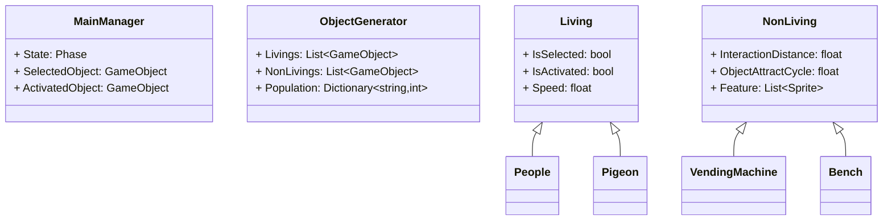
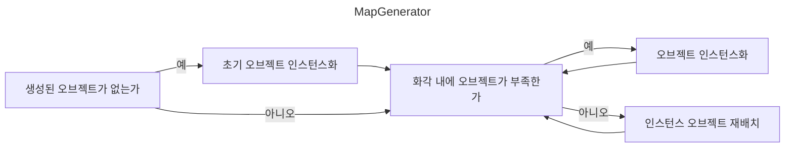
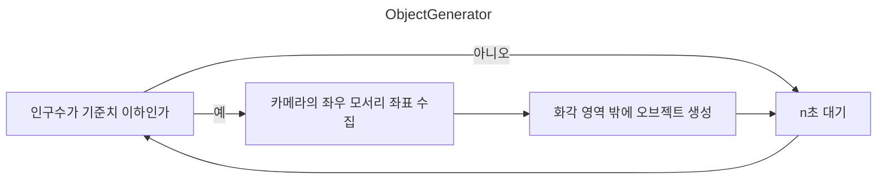
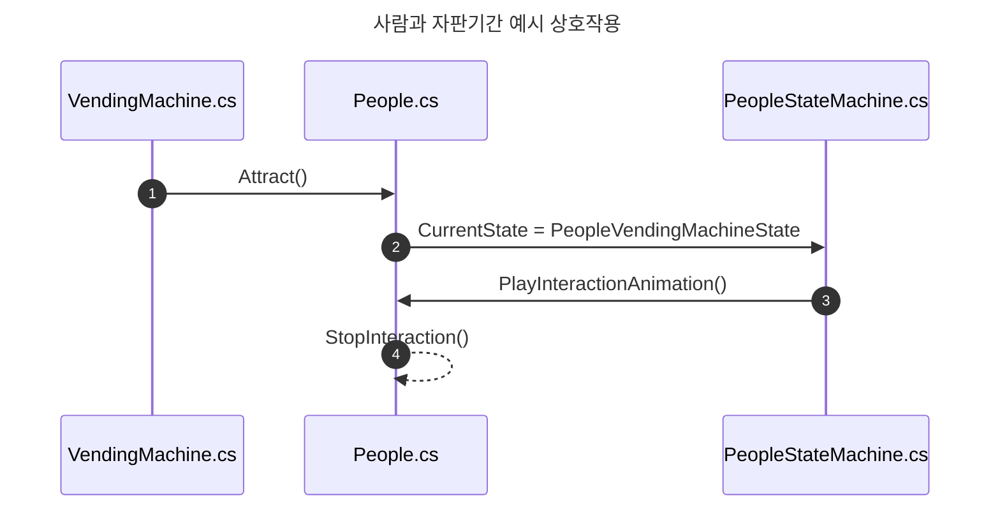
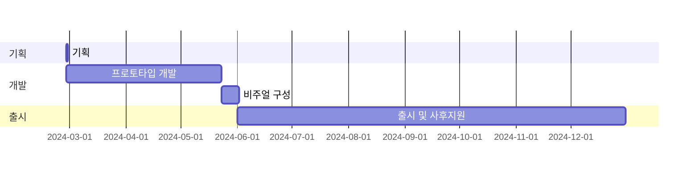

## **들어가며**

> **[전 글](https://hynrng.github.io/posts/armonia-planning/)**로부터 이어집니다.
{: .prompt-info }

너무 재밌어서 다시 도전하는 제 **[네 번째 마일스톤](https://hynrng.github.io/categories/%ED%94%84%EB%A1%9C%EA%B7%B8%EB%9E%98%EB%B0%8D/)** 개발기입니다. 만들면서 메모를 정리할 겸 중간 점검이 필요하기도 해서 약 한 달 동안 만든 결과물을 간단히 정리했습니다.

## **아카이브** {#archive}

<!--{: .w-75 }-->
{: .w-75 }
{: .w-75 }
_각각 사람과 비둘기를 구현했을 때. 플레이어는 아무 사람 또는 비둘기가 되어 주변환경과 상호작용할 수 있다._

## **에셋**

### **이미지 에셋**

<!---->

_그린 배경 이미지_

교외지에 있을 법한 배경을 만들고자 도시 일러스트, 동네 건물 사진이나 로드뷰 등을 찾아 참조하며 배경 이미지 에셋을 만들었습니다. 사람이 직접 그린 느낌이 났으면 좋겠어서 거친 질감의 선을 쓰면서 직선 도구도 일부러 사용하지 않았는데 결과적으로 약간의 엉성함과 삐뚤빼뚤함이 잘 나타난 것 같아서 마음에 들어요.

언어 번역과 같은 현지화 가능성을 열어두고 싶어 광고지나 신문지, 캘리그라피가 들어간 간판 등 텍스트가 필요한 요소를 넣지 않았습니다. 없어도 크게 어색하지 않기도 하구요.

그리고 보니 뿌듯하고 좋은데 다만 해상도를 너무 높은 것 같습니다. 이미지 다운스케일도 해봤지만 처음부터 저해상도로 만든 이미지가 아니다보니 많이 뭉개져서 별로였어요. 조금 더 저해상도로 그렸어도 같은 느낌을 충분히 낼 수 있었을 것 같아서 아쉽습니다.

### **스프라이트 셰이더**

<!--
{: .w-75 }
_유니티 셰이더 그래프_
-->

개발 도중 봉착한 난관입니다. 이 프로젝트의 오브젝트는 공통적으로 스프라이트 컴포넌트를 이용하고 있는데 유니티의 기본 셰이더 중에는 그림자를 받는 것(Receive Shadow)이 가능한 스프라이트용 셰이더가 없어서 다른 분이 만든 것을 찾아 사용하고 있습니다.

사용해보니 이 셰이더는 잘 작동하지만 기본적으로 Unlit 셰이더이기 때문에 그림자를 생성(Cast Shadow)하지는 않습니다. 오브젝트끼리 그림자가 졌으면 해서 더 알아보니 Unlit 셰이더는 Cast Shadow 기능 구현이 아예 불가능하더라구요. 스프라이트에 적용 가능하고, 빛 반사 없이 그림자를 생성하는 셰이더가 필요한데 셰이더에 대해서는 문외한이라 구현이 어렵습니다. 이 부분은 더 알아봐야 할 것 같아요.

### **애니메이션 에셋**

{: .light .w-25 .border }
{: .dark .w-25 }
_하늘 나는 비둘기_

애니메이션은 직접 그려서 사용하기도 했습니다. 예를 들어 비둘기 움직임의 경우 유니티 애니메이션 컴포넌트로 해결하기가 힘들어 전통적인 애니메이션 만들듯이 한 프레임씩 그림을 그려서 이어붙였어요. 이전에 동물의 움직임을 애니메이션으로 그려본 적은 없어서 비둘기 걷는 영상, 나는 영상을 찾아 관찰하며 그렸습니다. 생소하기도 하고 신기하기도 했네요.

만들면서는 단순한 단일 애니메이션을 만들어 사용하기보다 애니메이션의 흐름을 세분화해서 페이즈를 나누었습니다. 예를 들어 비둘기가 날아가는 모습의 경우 하늘로 날아오르는 EnterFly 애니메이션, 공중에 체공중인 BeingFly 애니메이션, 땅에 착지하는 EndFly 애니메이션 세 가지의 별개 묶음으로 나누어 출력했고, 이를 상태 패턴과 연동해서 사용했어요. 덕분에 결과물은 위 **[아카이브](#archive)**에서 볼 수 있듯이 꽤 그럴듯하게 보입니다.

_걸어다니는 사람과 감성 반딧불이_

다만 기본적으로는 이렇게 유니티의 애니메이션 컴포넌트를 이용했습니다. 위 예시는 사람의 위치변화에 따라 걷는 애니메이션의 좌우반전 여부나 재생속도가 자동으로 조절되도록 만든 장면인데요, 미리 자료를 남기지 못해 잘 나타나지는 않지만 컷 애니메이션 없이 머리와 몸통, 팔다리를 조각조각 조립해 위치가 각각 따로 조절되는 모습입니다.

여담이지만, 애니메이션 관련 작업이 가장 힘든 것 같아요. 특히 애니메이팅은 프로그래밍과 달리 개인 차원에서 별다른 돌파구가 없다는 점이 매번 크게 다가옵니다. 작업효율이 개인 기량에 좌지우지되죠. 프로 애니메이터분들이 존경스럽습니다.

## **개발**

**[직전의 경험](https://hynrng.github.io/posts/palette-developing/)**에서 아쉬웠던 부분을 개선하기 위한 노력이 많이 있었습니다. 특히 코드의 유지보수성을 놓치지 않도록 SOLID 원칙을 의식했죠. 클래스가 좀 커질 것 같다 싶으면 단일책임 원칙을 충분히 준수할 수 있도록 어김없이 분할했고, 접근 제한자 키워드도 보다 신중히 선택해 사용했고, 좀 더 세부적으로는 클래스 애트리뷰트나 `#region`도 적극적으로 활용했습니다.

중간중간 백업이 필요하다는 생각에 **[유니티 버전 컨트롤(VCS)](https://www.plasticscm.com/)**도 사용해봤는데 너무 편했습니다. 깃허브에 익숙하다면 금방 적응이 가능하고, 특히 작업 도중 언제든 유니티 내부 인터페이스로 업로드가 가능하다는게 좋았어요.

### **클래스 설계**

개발에 들어가기 전에 클래스의 역할과 클래스간 관계를 고려하면서 기본 틀을 구상했습니다. 다만 UML 다이어그램을 그리는 정도까지는 아니고, 개인 차원에서 너무 즉흥적인 설계로 복잡한 구조가 만들어지는 일을 예방할 수 있을 정도로 형식화했어요. 위 이외에도 다른 클래스에 대한 내용이 있지만, 다 담아내면 다이어그램이 너무 크고 복잡해져서 아주 대표적인 것들로만 추렸습니다.

스크립트의 멤버 외에도 `MainManager`는 싱글톤으로 사용하며 이벤트 주도적 프로그래밍을 사용한다는 것과 `Living`과 `NonLiving`은 부모 스크립트로서 상태 패턴을 이용한다는 것 정도를 사전에 염두해 두었으며, 실제로 그대로 실현했습니다.

개발 도중 프로그래밍 패턴을 몇 개 도입하거나 `MainManager.cs`{: .filepath }로부터 비대해진 터치 관련 코드를 `TouchManager.cs`{: .filepath }로 분리하는 등 실제 형태는 달라진 부분이 많지만 우선 큰 틀을 잡고 가니 확실히 편했습니다. 이번에 많은 도움이 돼서 다음에도 무언가 개발할 일이 있으면 간단한 다이어그램 정도는 그려두려 해요.

### **맵 생성과 관리**

<!--
{: .w-75 }
_배경 조정 예시_
-->

맵 구성의 경우 직접 만들어본 것은 처음입니다. 사전에 BSP와 같은 절차적 맵 생성 알고리즘도 찾아보았지만 제가 만들고 싶은 것과는 거리가 있는 것 같고, 또 그렇게 복잡한 시스템이 필요한 것 같지는 않아서 직접 만들게 되었습니다.

크게 다음의 조건을 만족하면 될 것 같다고 생각했습니다.
: - 한 번 생성된 맵은 게임 종료 시점까지 보존됨
- 맵 관련 오브젝트는 화면 안에서만 보임
- 매 판 리스트 순서를 섞어 맵을 다르게 구성함

결과적으로 기기별 화면비율에 상관없이 동작할 수 있도록 화각을 기준으로 작동하는 단계적인 맵 생성 절차를 만들었습니다. 게임오브젝트 리스트를 이용하여 리스트의 첫 번째 값은 좌측 끝자락에 있는 오브젝트, 리스트의 마지막 값은 우측 끝자락의 오브젝트로 유지되며 카메라의 화각에 따라 오브젝트가 새로 인스턴스화되거나 순서가 조정되는 식이죠.

현재까지는 문제없이 잘 작동하지만 제가 손수 만든 것으로서 검증된 것이 아니기 때문에 조금 불안한 느낌이 있습니다.

### **오브젝트 생성**

<!--
{: .w-75 }
_배경 조정 예시_
-->

오브젝트 생성은 위와 같이 이루어집니다. 이 경우에는 전에 비슷한 코드를 작성해본 적이 있기 때문에 크게 어렵지 않았어요. `ViewportToWorldPoint()`를 이용해 화각 밖에서 오브젝트 인스턴스화가 이루어지고, 오브젝트는 인스턴스화된 뒤 화각 밖에서 n초가 지나면 사라지도록 만들었습니다.

다만 아직 보완할 부분이 있습니다. 예를 들어 카메라가 좌우 한쪽 방향으로 빠르게 이동하는 경우 예를 들어 사람 없이 텅 빈 마을이 보이다 시간이 흐르고 좌우에서 사람이 하나 둘 나타나기 시작하는데, 보기에 매우 어색하기 때문에 카메라 좌우 영역의 오브젝트 밀도가 일정하게 유지되는 식으로 해결해야 할 것 같아요.

### **상호작용**

오브젝트간 상호작용의 경우 상호작용 주체가 되는 오브젝트가 상호작용을 호출하도록 만들었습니다. 코루틴에서 일정시간 간격마다 `Physics.OverlapBox`를 이용한 범위 내의 오브젝트를 구한 뒤, 그 중 랜덤한 오브젝트에 대해 상호작용을 호출하죠. 상태 패턴을 이용했고, 세부적으로는 위와 같이 동작합니다.

다만 제가 아직 상태 패턴을 사용하는 것에 익숙하지 않아서 그런건지 과정이 너무 복잡하다는 느낌이 있습니다. 상호작용을 이것보다 더 간단하게 구현하는 방법이 있나 궁금하네요.

## **마치며**

지금까지 개발을 진행해보니 게임 개발이 분명히 재미있고 또 뿌듯한 부분이 있습니다. 먼저 체계를 구상하고, 구상한 기획안을 토대로 자료를 수집하고, 자료가 부족하다면 직접 만들어 적용하고, 그런 복합적인 과정을 통해 나온 결과물이 확실한 시각적 피드백으로 다가오다보니 색다른 성취감이 분명 있는 것 같아요.

향후 다음의 과제가 남아있습니다.
: - 효과음 오디오 추가
- 절차적 애니메이션 활용
- 오브젝트 및 상호작용 다양화

또는 다음을 시도해보고 싶습니다.
: - 토스트 알람
- 공기 원근법

개발 도중 블로그를 열심히 재단장하느라 2주정도 시간을 많이 허비한 부분이 있습니다. 남은 한달 정도 시간에는 집중이 분산되지 않게 절제하면서 기간 내에 잘 마무리할 수 있으면 좋겠습니다.

