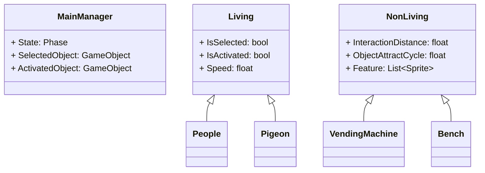
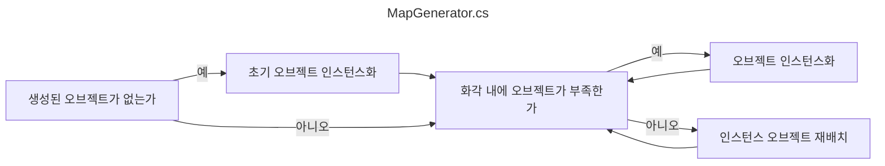
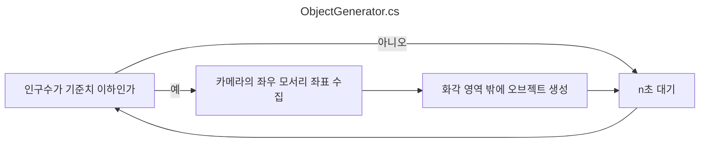
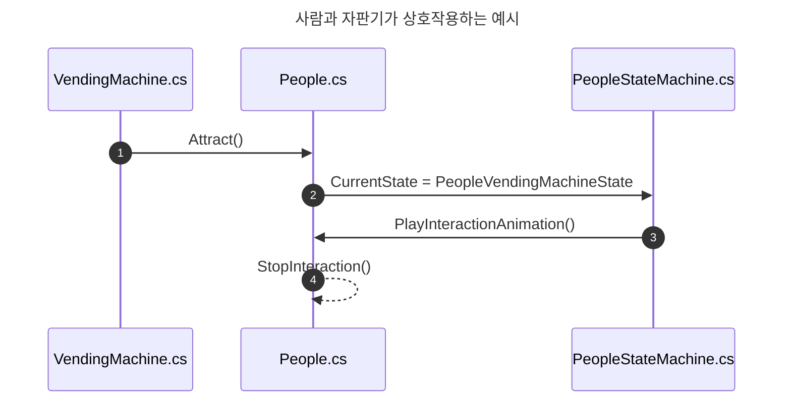
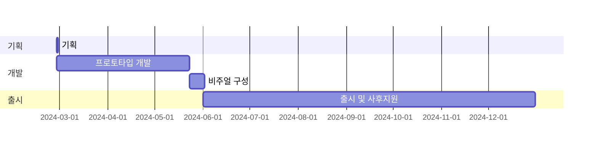

## **들어가며**

> **[전 글](https://hynrng.github.io/posts/armonia-planning/)**로부터 이어집니다.
{: .prompt-info }

너무 재밌어서 다시 도전하는 제 **[네 번째 마일스톤](https://hynrng.github.io/categories/%ED%94%84%EB%A1%9C%EA%B7%B8%EB%9E%98%EB%B0%8D/)** 개발기입니다. 만들면서 메모를 정리할 겸 중간 점검이 필요하기도 해서 약 한 달 동안 만든 결과물을 간단히 정리했습니다.

## **에셋**

### **이미지 에셋**

<!---->

_그린 배경 이미지_

교외지에 있을 법한 배경을 만들고자 도시 일러스트, 동네 건물 사진이나 로드뷰 등 관련 이미지를 찾아 참조하며 그림 이미지 에셋을 만들었습니다. 사람이 직접 그린 느낌이 났으면 좋겠어서 직선 도구도 일부러 사용하지 않았는데 그리고 보니 약간의 엉성함이 보여서 마음에 드네요.

텍스트의 경우도 일부로 넣지 않았습니다. 사실 광고지나 신문지, 캘리그라피 간판으로 특이한 분위기를 낼 수 있을 것 같아 고민했으나 언어 번역 등 현지화 잠재력을 만들고 싶어서 추가하지 않았습니다. 없어도 크게 어색하지 않기도 하구요.

그리고 보니 뿌듯하고 좋은데 다만 해상도를 너무 높게 잡은 것 같습니다. 이미지 다운스케일도 해봤지만 처음부터 저해상도로 만든 이미지가 아니다보니 많이 뭉개져서 별로더라구요. 이것보다 조금 더 저해상도로 그렸어도 같은 느낌을 충분히 낼 수 있었을 것 같아서 아쉽습니다.

### **스프라이트 셰이더**

<!--
{: .w-75 }
_유니티 셰이더 그래프_
-->

이 프로젝트의 오브젝트는 공통적으로 스프라이트 컴포넌트를 이용하는데 유니티의 기본 셰이더 중에는 그림자를 받는 것(Receive Shadow)이 가능한 스프라이트용 셰이더가 없어서 다른 분이 만든 것을 찾아 사용하고 있습니다.

사용해보니 이 셰이더는 잘 작동하지만 그림자를 생성(Cast Shadow)하지는 않습니다. 이유를 알아보니 빛 반사를 하지 않는 Unlit 셰이더는 기본적으로 그림자를 생성하지 않기 때문이었습니다. 저는 오브젝트끼리 그림자가 지는 느낌이 나면 좋겠는데, 이 부분은 더 알아봐야 할 것 같습니다.

### **애니메이션 에셋**

{: .w-25 }
_하늘 나는 비둘기_

애니메이션은 직접 그려서 사용하기도 했습니다. 비둘기 움직임의 경우에 유니티 애니메이션 컴포넌트로 해결하기가 힘들어 전통적인 애니메이션 만들듯이 한 프레임씩 그림을 그려서 이어붙였어요. 이런 움직임은 그려본 적이 없어서 비둘기 걷는 영상, 나는 영상을 찾아 관찰하며 그렸습니다. 생소하기도 하고 신기하기도 했네요.

{: .w-75 }
_걸어다니는 사람과 감성 반딧불이_

다만 기본적으로는 이렇게 유니티의 애니메이션 컴포넌트를 이용했습니다. 위 예시는 사람의 위치변화에 따라 걷는 애니메이션의 좌우반전 여부나 재생속도가 자동으로 조절되도록 만든 장면인데요, 미리 자료를 남기지 못해 잘 나타나지는 않지만 컷 애니메이션 없이 머리와 몸통, 팔다리를 조각조각 조립해 위치가 각각 따로 조절되는 모습입니다.

## **개발**

**[직전의 경험](https://hynrng.github.io/posts/palette-developing/)**에서 아쉬웠던 부분을 개선하기 위해 노력했습니다. 특히 코드의 유지보수성을 놓치지 않도록 SOLID 원칙을 의식하면서 클래스가 좀 커질 것 같다 싶으면 단일책임 원칙을 충분히 준수할 수 있도록 어김없이 분할하고, `private`와 `public` 키워드도 사용처를 보다 확실히 구분했습니다. 개발하면서 클래스 애트리뷰트나 `#region`도 적극적으로 활용했네요.

### **클래스 설계**

먼저 위와 같이 클래스의 역할과 클래스간 관계를 고려하면서 기본 틀을 구상했습니다. 위 이외에도 `ObjectGenerator.cs`{: .filepath }, `MapGenerator.cs`{: .filepath }, `MainCamera.cs`{: .filepath }... 등이 있지만 다 나타내면 다이어그램이 너무 크고 복잡해져서 대표적인 클래스와 클래스의 멤버를 3가지씩 추리니 위와 같이 정리할 수 있네요.

개발 도중 프로그래밍 패턴을 몇 개 도입하거나 `MainManager.cs`{: .filepath }로부터 비대해진 터치 관련 코드를 `TouchManager.cs`{: .filepath }로 분리하는 등 점점 달라진 부분은 많지만 우선 큰 틀을 잡고 가니 확실히 편했습니다.

### **맵 생성과 관리**

<!--
{: .w-75 }
_배경 조정 예시_
-->

맵 구성의 경우 직접 만들어본 것은 처음이었습니다. 사전에 BSP와 같은 절차적 맵 생성 알고리즘도 찾아보았지만 제가 만들고 싶은 것과는 거리가 있는 것 같더라구요.

그래서 만들기 전에 원론적으로 생각해보니 한 번 생성된 맵은 게임 종료 시점까지 보존되고, 맵 관련 오브젝트는 화면 안에서만 보이면 될 것이라는 생각에 `List<GameObject>`로 동작하는 단계적인 맵 생성 절차를 만들었습니다. 우선은 잘 동작하지만, 어떤 사전 지식을 반영한 것이 아니기 때문에 불안한 느낌이 있네요.

### **오브젝트 생성**

<!--
{: .w-75 }
_배경 조정 예시_
-->

오브젝트 생성은 위와 같이 이루어집니다. `ViewportToWorldPoint()`를 이용해 화각 밖에서 오브젝트 인스턴스화가 이루어지도록 만들었어요. 오브젝트는 인스턴스화된 뒤 화각 밖에서 n초가 지나면 사라집니다.

잘 동작하지만 아직 보완할 부분이 있습니다. 예를 들어 카메라가 좌우 한쪽 방향으로 빠르게 이동하는 경우 예를 들어 사람 없이 텅 빈 마을이 보이다 시간이 흐르고 좌우에서 사람이 하나 둘 나타나기 시작하는데, 보기에 매우 어색하기 때문에 카메라 좌우 영역의 오브젝트 밀도가 일정하게 유지되는 식으로 해결해야 할 것 같아요.

### **상호작용**

상호작용 주체가 되는 오브젝트가 상호작용을 호출합니다. 코루틴에서 일정시간 간격마다 `Physics.OverlapBox`를 이용한 범위 내의 오브젝트를 구한 뒤, 그 중 랜덤한 오브젝트에 대해 상호작용을 호출하도록 만들었어요. 상태 패턴을 이용했고, 세부적으로는 위와 같이 동작합니다.

우선은 잘 동작하지만 제가 아직 상태 패턴에 익숙하지 않아서 그런건지 너무 복잡하다는 느낌이 있습니다. 상호작용을 이것보다 더 간단하게 구현하는 방법이 있나 궁금하네요.

## **마치며**

지금까지 개발을 진행해보니 게임 개발이 분명히 재미있고 또 뿌듯한 부분이 있습니다. 먼저 체계를 구상하고, 구상한 기획안을 토대로 자료를 수집하고, 자료가 부족하다면 직접 만들어 적용하고, 그런 복합적인 과정을 통해 나온 결과물이 확실한 시각적 피드백으로 다가오다보니 색다른 성취감이 분명 있는 것 같아요.

앞으로 남은 기간동안 작업에 염두해두고 있는 것은 아래와 같습니다.

향후 다음과 같은 과제가 남아있습니다.
: - 효과음 오디오 추가
- 절차적 애니메이션 활용

또는 다음을 시도해보고 싶습니다.
: - 토스트 알람
- 공기 원근법

중간에 블로그에 열중하느라 2주정도 시간을 많이 허비한 부분이 있습니다. 남은 한달 정도 시간에는 집중이 분산되지 않게 절제하면서 기간 내에 잘 마무리할 수 있으면 좋겠습니다.

