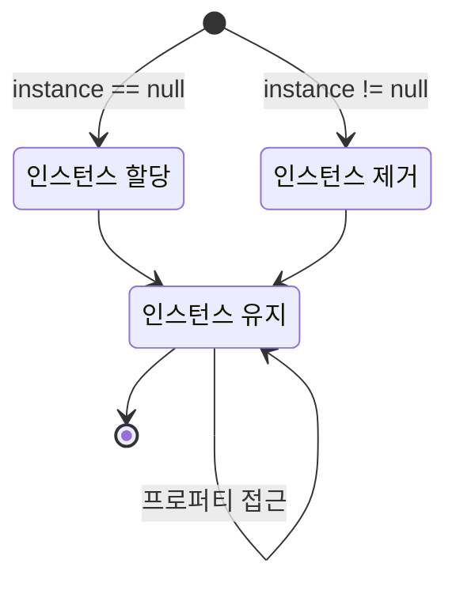

# **들어가며**

싱글톤 패턴은 특정 클래스의 인스턴스가 단 하나만 존재하도록 보장하는 디자인 패턴입니다. **[현재 개발중인 게임](https://hynrng.github.io/posts/armonia-planning/)**에서도 매우 유용하게 사용중이어서 정리해두려고 합니다. 주로 아래와 같은 장점이 있습니다.

- 특정 기능이나 데이터를 어디서든 쉽게 접근하고 공유할 수 있음
- 게임의 전반적인 상태를 여러 스크립트나 씬에서 동일하게 유지할 수 있음
- 오디오, 스프라이트, 오브젝트 등과 같은 데이터를 중복 없이 관리할 수 있음

# **구조 시각화**



# **기본 코드**

```cs
public class Singleton : MonoBehaviour
{
    private static Singleton instance = null;
    public static Singleton Instance
    {
        get
        {
            if (instance == null)
                return null;
                
            return instance;
        }
    }

    void Awake()
    {
        if (instance == null)
        {
            instance = this;

            DontDestroyOnLoad(this.gameObject);
        }
        else
            Destroy(this.gameObject);
    }

    /* 함수 작성란 */
}
```
{: file="Singleton.cs" }

유니티에서 싱글톤 패턴은 매우 단순하게 구현됩니다. 상단의 get set 프로퍼티 부분와 하단의 `Awake()` 모두 인스턴스가 단 한 개만 존재하도록 보장하고 있으며, 스크립트의 인스턴스는 `static`으로 선언되어 있으므로 싱글톤 패턴이 사용된 스크립트의 필드나 메서드는 외부 클래스에서 `스크립트명.Instance` 형식으로 접근이 가능합니다.

모든 씬에서 범용적으로 존재하고 단 한 개로 유지된다는 특징은 `GameManager.cs`{: .filepath }에 활용하기에 적합하다는 이야기이기도 합니다. 게임의 데이터나 상황 등을 총괄하는 스크립트는 일반적으로 여러개 씬에서 한 개로 처리하기 때문이죠. 저 또한 게임 매니저 스크립트에 싱글톤 패턴을 활용하고 있습니다.

# **활용 예시**

```cs
public class GameManager : MonoBehaviour
{
    public int Number = 314;

    /* 싱글톤 선언부 */

    public void DisplayNumber(int number)
    {
        Debug.Log($"The number is {number}");
    }
}
```
{: file="GameManager.cs" }

```cs
public class OtherClass : MonoBehaviour
{
    void Start()
    {
        int ManagerNumber = GameManager.Instance.Number;

        GameManager.Instance.DisplayNumber(ManagerNumber);
    }
}
```
{: file="OtherClass.cs" }

단순 동작을 보여주기 위해 게임 매니저에 사용한 예시입니다. 예시의 `OtherClass.cs`{: .filepath }는 클래스 내부에서 필드나 메서드를 선언하지 않고 외부의 게임 매니저 인스턴스에서 `Number` 필드와 게임 매니저의 `DisplayNumber()` 메서드만을 사용하고 있죠. 게임 매니저의 `Number`는 314로 선언되었으므로 실행 결과는 아래와 같이 표시됩니다.

```bash
The number is 314
```
{: .nolineno }

이러한 특징을 살려 `GameSystem.cs`{: .filepath }와 같은 매니저 유형의 스크립트를 싱글톤 인스턴스로 사용할 경우, 예를 들어 아래와 같은 필드나 메서드를 구성하여 전역적으로 제공할 수 있습니다.

필드
: - `Score`, `CurrentLevel`, `EnemyCount`: 레벨이나 점수, 남은 적 수 등의 주요 게임 상태를 저장
- `isGamePaused`, `IsMusicEnabled`: 게임의 일시정지 여부 또는 배경음악의 활성화 여부 등을 저장

메서드
: - `StartGame()`, `QuitGame()`: 게임이 시작되거나 종료될 때 사용
- `PauseGame()`, `ResumeGame()`: 게임이 일시정지되거나 재개될 때 사용
- `LoadScene()`, `LoadLevel()`: 특정 씬이나 레벨을 불러올 때 사용

# **주의사항**

싱글톤 패턴은 한 번 사용하면 매우 편리하기 때문에 금방 남용하기 쉽습니다. 그러나 싱글톤 스크립트가 너무 많은 역할이나 데이터를 담당하면 싱글톤 스크립트를 참조하는 클래스와의 결합도가 과도히 높아지며, 싱글톤 인스턴스의 변경 주체나 시점을 알기 어려워질 수 있습니다. 스파게티 코드화가 이루어지는 것이죠.

일반적인 코드 작성이 그렇듯이 싱글톤 패턴 또한 오랫동안 오남용되면 되돌리기 어렵기 때문에, 사용 전에 대체제가 없는지 고민하며 사용을 신중히 할 필요가 있습니다.