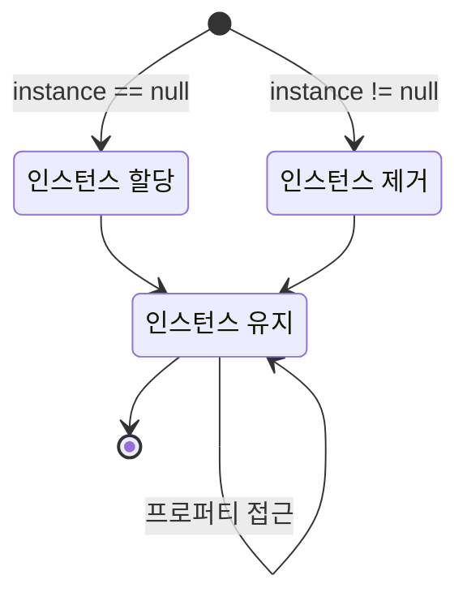

## **들어가며**

게임을 개발하다 보니 개념적 정리가 필요한 기술 사항들이 많다는 것을 점점 느끼고 있습니다. 평소 메모를 위해 노션이나 옵시디언을 활용하고는 있지만 아무래도 저 혼자 글을 작성하면 너무 편하게 쓰는 나머지 금세 난잡해지더라구요. 그래서 앞으로 따로 숙지가 필요한 것들은 아예 한 번씩 심도있게 짚고 넘어갈 겸 블로그에 차근차근 하나씩 정리해두려고 합니다.

그 중 처음으로 다룰 것은 싱글톤(Singleton) 패턴입니다. 싱글톤 패턴은 특정 클래스의 인스턴스가 단 하나만 존재하도록 보장하는 디자인 패턴으로, 주로 아래와 같은 장점이 있어 사용합니다.

- 게임의 전반적인 상태를 여러 스크립트나 씬에서 동일하게 유지 가능함
- 오디오, 스프라이트, 오브젝트 등과 같은 데이터를 중복 없이 관리 가능함
- 개별 클래스에서 무거운 코드를 중복 사용하는 상황을 피할 수 있어 성능이 좋음

싱글톤 패턴을 가장 먼저 소개하는 이유는 이것이 직관적이기 때문입니다. 게임 개발을 배울 때 코드를 작성하는 법이 어느정도 손에 익었다 싶으면 이 패턴을 접하게 되는 분들이 많죠. 싱글톤 패턴은 그만큼 개념도 간단하고, 사용하기도 어렵지 않습니다.

## **구조 시각화**



## **기본 코드**

```cs
public class Singleton : MonoBehaviour
{
    private static Singleton instance = null;
    public static Singleton Instance
    {
        get
        {
            if (instance == null)
                return null;
                
            return instance;
        }
    }

    void Awake()
    {
        if (instance == null)
        {
            instance = this;

            DontDestroyOnLoad(this.gameObject);
        }
        else
            Destroy(this.gameObject);
    }
}
```
{: file="Singleton.cs" }

싱글톤 패턴의 규칙은 다음의 두 개로 정리할 수 있습니다.

- 클래스의 인스턴스를 단 한 개로 보장한다 (Ensures that a class can only instantiate one instance of itself)
- 한 개의 인스턴스로 전역적인 접근을 제공한다 (Gives easy global access to that single instance)

그래서 유니티에서 싱글톤 패턴은 매우 단순하게 구현됩니다. 상단의 프로퍼티 부분와 하단의 `Awake()` 모두 인스턴스가 단 한 개만 존재하도록 보장하고 있을 뿐이죠. 스크립트의 인스턴스는 `static`으로 선언되어 있으므로 싱글톤 패턴이 사용된 스크립트의 필드나 메서드는 외부 클래스에서 `스크립트명.Instance` 형식으로 접근이 가능합니다.

## **여러 개 만들기**

싱글톤 스크립트의 인스턴스는 기본적으로 단 한 개로 유지되므로 개념적으로는 싱글톤 인스턴스를 여러 개 사용할 수 없습니다. 코드를 복사해 어찌저찌 사용할 수는 있지만 비효율적이죠. 대신, 여러 개의 서로 다른 싱글톤 인스턴스가 필요한 경우 제네릭을 사용하여 `Singleton<T>`의 형태로 서로 다른 싱글톤 스크립트를 여러 개 생성하여 사용할 수 있습니다.

```cs
public class Singleton<T> : MonoBehaviour where T : MonoBehaviour
{
    private static T instance;
    public static T Instance
    {
        get
        {
            if (instance == null)
                return null;

            return instance;
        }
    }

    private void Awake()
    {
        if (instance == null)
        {
            instance = this as T;
            DontDestroyOnLoad(gameObject);
        }
        else
            Destroy(gameObject);
    }
}
```
{: file="Singleton.cs" }

```cs
public class GameManager : Singleton<GameManager>
{
    /* 코드 작성 */
}
```
{: file="GameManager.cs" }

이 경우 다른 클래스도 상속을 통해 통해 간단히 싱글톤으로 변경할 수 있게 해줍니다. 예를 들어 `GameManager.cs`{: .filepath }에 싱글톤을 적용하고 싶다면 위와 같이 `Singleton<T>`를 상속하는 형태로 사용할 수 있습니다.

## **인스턴스 생성**

단, 위 코드의 경우 싱글톤 인스턴스가 없을 때 인스턴스를 단순히 `null`로 처리하고 새 인스턴스를 생성하지 않으므로 외부 스크립트에서 인스턴스에 접근할 때 `Instance`가 유무를 체크해야 하는 번거로움이 있을 수 있습니다. 이 부분이 불편한 경우 프로퍼티 부분을 수정해 아래와 같이 인스턴스화 코드까지 연결할 수 있습니다.

```cs
public class Singleton : MonoBehaviour
{
    private static Singleton instance = null;
    public static Singleton Instance
    {
        get
        {
            if (instance == null)
            {
                GameObject gameObj = new GameObject();
                instance = gameObj.AddComponent<Singleton>();
                DontDestroyOnLoad(gameObj);
            }
                
            return instance;
        }
    }
}
```
{: file="Singleton.cs" }

## **사용 예시**

모든 씬에서 범용적으로 존재하고 단 한 개로 유지된다는 특징은 `GameManager.cs`{: .filepath }에 활용하기에 적합하다는 이야기이기도 합니다. 게임의 데이터나 상황을 총괄하는 스크립트는 일반적으로 단 한 개로 처리하기 때문이죠. 저 또한 **[현재 개발중인 게임](https://hynrng.github.io/posts/armonia-planning/)**에서 게임 매니저 스크립트에 싱글톤 패턴을 사용하고 있습니다.

이와 관련하여 게임 매니저에 싱글톤 패턴을 사용한 예시는 아래와 같습니다. 플레이어가 적과 싸우는 상황을 가장했으며, 플레이어가 적을 처치하면 점수가 오르고, 죽으면 점수가 초기화됩니다.

```cs
public class GameManager : MonoBehaviour
{
    /* 싱글톤 선언부 */

    public int Score;

    public void ResetScore()
    {
        Score = 0;
    }
}
```
{: file="GameManager.cs" }

```cs
public class Player : MonoBehaviour
{
    void AttackEnemy()
    {
        Enemy.TakeDamage();

        if (Enemy.HP <= 0)
        {
            Destroy(Enemy);

            GameManager.Instance.Score += 100;
        }
    }

    void Dead()
    {
        GameManager.Instance.ResetScore();
    }
}
```
{: file="Player.cs" }

이를 위해 게임 매니저에는 `Score`와 `ResetScore()`가 정의되어 있으며, `Player.cs`{: .filepath }는 외부 클래스로서 싱글톤 인스턴스를 통해 게임 매니저의 `Score`와 `ResetScore()`에 직접 접근하고 있습니다. 적이 죽으면 `Player.cs`{: .filepath }가 점수를 직접 올리고, 플레이어가 죽으면 점수를 직접 초기화하고 있죠. 직접 접근이 가능하기 때문에 번거로운 `GameManager`의 인스턴스 생성 과정 없이도 `Player.cs`{: .filepath } 코드 내부에서 이러한 코드 구성이 가능합니다.

이와 같이 `GameSystem.cs`{: .filepath } 등의 매니저 스크립트를 싱글톤으로 사용할 경우, 예를 들어 아래와 같은 필드나 메서드를 구성하여 전역적으로 제공할 수 있습니다.

필드
: - `Score`, `CurrentLevel`, `EnemyCount`: 레벨이나 점수, 남은 적 수 등의 주요 게임 상태를 저장
- `isGamePaused`, `IsMusicEnabled`: 게임의 일시정지 여부 또는 배경음악의 활성화 여부 등을 저장

메서드
: - `StartGame()`, `QuitGame()`: 게임이 시작되거나 종료될 때 사용
- `PauseGame()`, `ResumeGame()`: 게임이 일시정지되거나 재개될 때 사용
- `LoadScene()`, `LoadLevel()`: 특정 씬이나 레벨을 불러올 때 사용

## **주의사항**

단, 싱글톤 패턴은 논란이 있는 프로그래밍 패턴입니다. 주요 요지는 남용하기 쉽다는 것이죠. 싱글톤이 너무 편리한 나머지 스크립트가 너무 많은 역할이나 데이터를 담당하게 되면 싱글톤 인스턴스와 다른 클래스의 결합이 강해지며, 지저분해진 코드는 싱글톤 인스턴스의 변경 주체나 시점을 알기 어렵게 만든다는 겁니다.

따라서 사용 전에 대체제가 없는지 고민하며 충분히 신중할 필요가 있습니다. 일반적인 코드 작성이 그렇듯이 싱글톤 패턴 또한 오랫동안 오남용되면 되돌리기 어렵기 때문이죠. 싱글톤 패턴을 사용한다면 소수의 스크립트만이 싱글톤 인스턴스에 접근할 수 있도록 만드는 것이 좋습니다.

그래도 여전히 사용하기 쉽고, `GetComponent()`나 `Find()` 등 무거운 함수의 중복 실행을 피할 수 있다는 점 때문에 프로젝트 규모에 따라 충분히 사용할만한 가치가 있다고 할 수 있습니다.