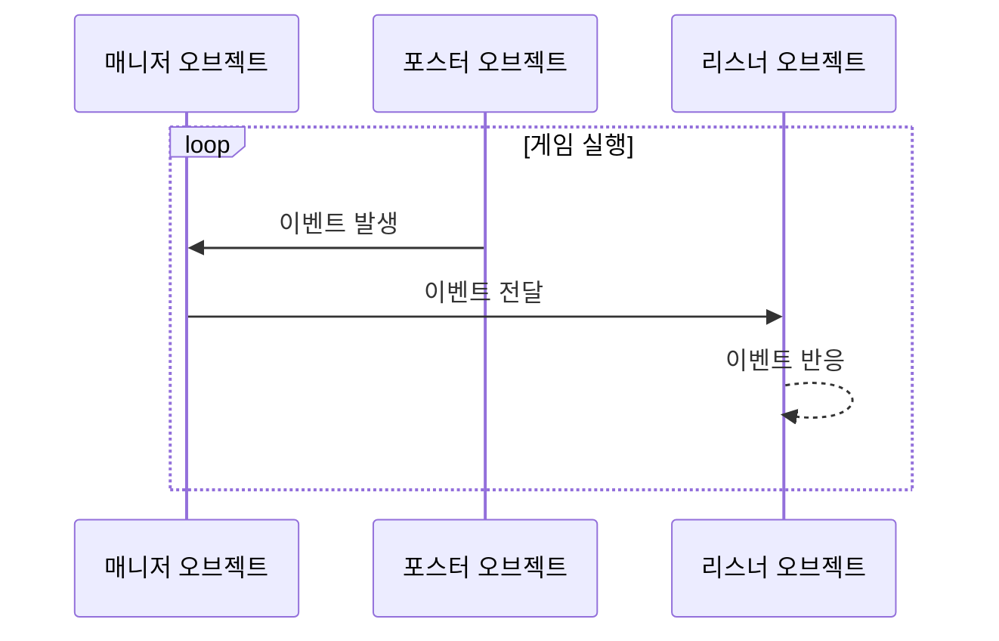

## **들어가며**

이벤트 주도적 프로그래밍(Event Driven Programming)은 프로그램의 흐름이 이벤트에 의해 결정되는 프로그래밍 패러다임으로, 이벤트의 발생, 관리, 실행을 주관하며 코드의 확장성을 높이고 가독성과 유지보수성을 관리하기 위해 사용합니다. [현재 개발중인 게임](https://hynrng.github.io/posts/armonia-developing-first/)에서 많은 도움이 되어 앞으로도 유용하게 사용할 수 있을 것 같아 글로 정리합니다.

## **기본 개념**

이벤트 주도적 프로그래밍은 다음의 세 가지 개념으로 구현됩니다.
: - 매니저(Manager): 특정 오브젝트에 이벤트를 전파하는 역할을 담당
- 리스너(Listener): 특정 이벤트에 반응하는 역할을 담당
- 포스터(Poster): 특정 이벤트를 발생시키는 역할을 담당

매니저 역할은 주로 `GameObject.cs`{: .filepath }와 같은 매니저 스크립트 한 곳에서 담당하지만, 리스너나 포스터 역할은 한 오브젝트가 모든 역할을 담당할 수도, 둘 중 하나의 역할만 담당할 수도 있습니다.

예를 들어 폭발음이 들리고 주위의 NPC가 소리가 난 곳을 향해 쳐다보는 상황을 가정할 때, 기본적으로 폭발음을 발생시키는 오브젝트는 포스터, 주위의 오브젝트는 리스너 역할을 하나씩 담당하겠지만 만약 폭발음을 발생시키는 오브젝트 또한 해당 이벤트에 반응하는 NPC라면 이 오브젝트는 포스터와 리스너 역할 둘 다 담당할 수 있습니다.

## **구조 시각화**



## **기본 코드**

### **이벤트 매니저**

> 코드 길이가 조금 긴 편입니다!
{: .prompt-info }

```cs
public enum EventType
{
    FirstExampleEvent,
    SecondExampleEvent,
    /* ... */
}
```
{: file="EventManager.cs" }

```cs
public class EventManager : MonoBehaviour
{
    public static EventManager Instance { get { return instance; } }    
    private static EventManager instance = null;

    public delegate void OnEvent(EventType eventType, Component Sender, object Param = null);
    private Dictionary<EventType, List<OnEvent>> Listeners
        = new Dictionary<EventType, List<OnEvent>>();

    void Awake()
    {
        if (instance == null)
        {
            instance = this;
            DontDestroyOnLoad(gameObject);
            return;
        }
        DestroyImmediate(gameObject);
    }

    public void AddListener(EventType eventType, OnEvent Listener)
    {
        List<OnEvent> ListenList = null;

        if (Listeners.TryGetValue(eventType, out ListenList))
        {
            ListenList.Add(Listener);
            return;
        }

        ListenList = new List<OnEvent>();
        ListenList.Add(Listener);
        Listeners.Add(eventType, ListenList);
    }

    public void PostNotification(EventType eventType, Component Sender, object param = null)
    {
        List<OnEvent> ListenList = null;

        if (!Listeners.TryGetValue(eventType, out ListenList))
            return;

        for(int i = 0; i < ListenList.Count; i++)
             ListenList?[i](eventType, Sender, param);
    }

    public void RemoveEvent(EventType eventType) => Listeners.Remove(eventType);

    public void RemoveRedundancies()
    {
        Dictionary<EventType, List<OnEvent>> newListeners
            = new Dictionary<EventType, List<OnEvent>>();

        foreach(KeyValuePair<EventType, List<OnEvent>> Item in Listeners)
        {
            for (int i = Item.Value.Count - 1; i >= 0; i--)
                if(Item.Value[i].Equals(null))
                    Item.Value.RemoveAt(i);

            if (Item.Value.Count > 0)
                newListeners.Add(Item.Key, Item.Value);
        }

        Listeners = newListeners;
    }

    public void RemoveListener(Event eventType, OnEvent listener)
    {
        List<OnEvent> listenList = null;

        if (Listeners.TryGetValue(eventType, out listenList))
            listenList.Remove(listener);
    }

    void OnLevelWasLoaded()
    {
        RemoveRedundancies();
    }
}
```
{: file="EventManager.cs" }

델리게이트를 이용한 방법입니다. 리스너 오브젝트에서도 일부 메서드를 사용할 수 있도록 [싱글톤 패턴](https://hynrng.github.io/posts/singleton-pattern/)을 이용하며, 이벤트는 `enum`을 이용해 정의합니다. 코드는 80줄 가까이 되지만 5개의 개별 메서드로 구성되어 있기 때문에 어렵지 않습니다.

델리게이트와 필드
: - `OnEvent()`: 이벤트 리스터의 이벤트 반응 메서드를 등록하는 델리게이트입니다.
- `Listeners`: 키는 이벤트, 값은 `List<OnEvent>`로 구성되는 딕셔너리입니다. 특정 이벤트와 이벤트에 대한 반응을 연결합니다.

메서드
: - `AddListener()`: 어떤 이벤트에 특정 오브젝트의 반응을 메서드 형태로 등록합니다.
- `PostNotification()`: 포스터 오브젝트가 이벤트를 발생시킬 때 사용하는 메서드입니다.
- `RemoveEvent()`: `Listeners` 딕셔너리에서 특정 이벤트를 제거하는 메서드입니다.
- `RemoveRedundancies()`: 일종의 무결성 검사입니다. 특정 이벤트에 대해 실행하는 것이 아무것도 없는 경우 해당 이벤트를 제거합니다.
- `RemoveListener()`: 리스너 오브젝트를 파괴할 때 `NullReferenceException` 오류를 방지하기 위해 `Listeners` 딕셔너리에서 해당 오브젝트를 제거합니다.

<!--
`AddListener(Event.FirstExampleEvent, OnEvent)`와 같은 형태로 사용합니다.
`PostNotification(Event.FirstExampleEvent, this)`와 같은 형태로 사용합니다.
-->

### **이벤트 리스너**

```cs
public class ListenerObject : MonoBehaviour
{
    void Start()
    {
        EventManager.Instance.AddListener(Event.ObjectAccessed, OnEvent);
    }

    public void OnEvent(EventType EventType, Component Sender, object Param = null)
    {
        switch (EventType)
        {
            case EventType.FirstExampleEvent:
                /* 이벤트 동작 코드 작성란 */
                break;
        }
    }

    void OnDestroy()
    {
        EventManager.Instance.RemoveListener(Event.ObjectAccessed, OnEvent);
    }
}
```
{: file="Listener.cs" }

게임이 시작되거나 오브젝트가 생성되면 원하는 이벤트를 감지할 수 있도록 `EventManager.AddListener()` 메서드로 리스너를 추가하고, 오브젝트가 파괴될 때 자잘한 에러 또는 불필요한 이벤트 호출을 방지하기 위해 `EventManager.RemoveListener()`로 등록된 메서드를 제거합니다.

`OnEvent()` 메서드는 이벤트가 발생했을 때 호출됩니다. 이벤트 타입, 이벤트를 발생시킨 객체, 그리고 추가적인 매개변수를 인수로 받아 `switch` 문으로 이벤트 유형에 따라 다른 로직을 처리할 수 있습니다. 이 예시에서는 `FirstExampleEvent` 이벤트에 대해 특정 로직을 작성할 수 있도록 구성되어 있습니다.

## **사용 예시**


[개발중인 게임](https://hynrng.github.io/posts/armonia-developing-first/)에 사용한 예시입니다. 특정 오브젝트를 선택하면 일부 상호작용 가능한 오브젝트가 노란색 계열로 표시되고, 해당 오브젝트를 선택 취소하면 다시 원래대로 돌아옵니다. 이벤트 주도적 프로그래밍을 통해 구현했습니다.